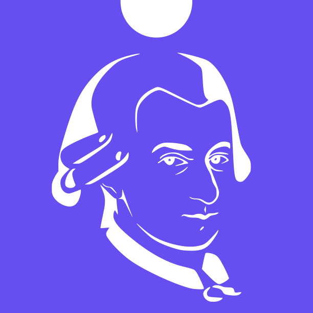

<div align="center">
    
    <h1>Wasmadeus</h1>
    <a href="https://github.com/lefebvreb/wasmadeus"></a>
    <a href="https://crates.io/crates/wasmadeus"></a>
    <a href="https://docs.rs/wasmadeus"></a>
</div>

<br>

An experimental frontend web framework in pure rust.

Wasmadeus is focused on simplicity, ease of use and performance.

```rust
TODO
```

## Features

Wasmadeus features:

+ Functional reactive programming (FRP) types and concepts.
+ Modular, customizable and reusable components.
+ Rustic API featuring no macro magic.
+ `no_std` support.
+ Integrates nicely with HTML, CSS and JavaScript.
+ Easy bundling with [trunk](https://trunkrs.dev/).

## Examples

See the [examples](https://github.com/L-Benjamin/wasmadeus/tree/main/examples) directory for a list of examples built with Wasmadeus.

<br>

#### License

<sup>
Licensed under either of <a href="LICENSE-APACHE">Apache License, Version
2.0</a> or <a href="LICENSE-MIT">MIT license</a> at your option.
</sup>

<br>

<sub>
Unless you explicitly state otherwise, any contribution intentionally submitted
for inclusion in this crate by you, as defined in the Apache-2.0 license, shall
be dual licensed as above, without any additional terms or conditions.
</sub>
